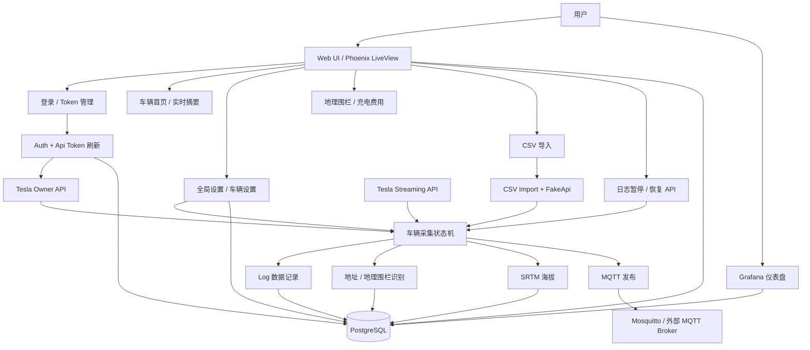
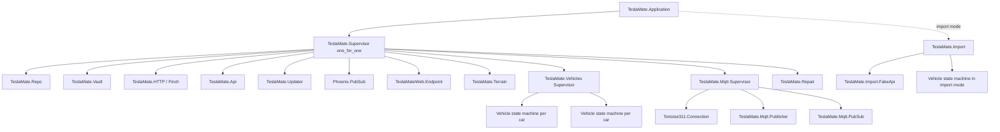
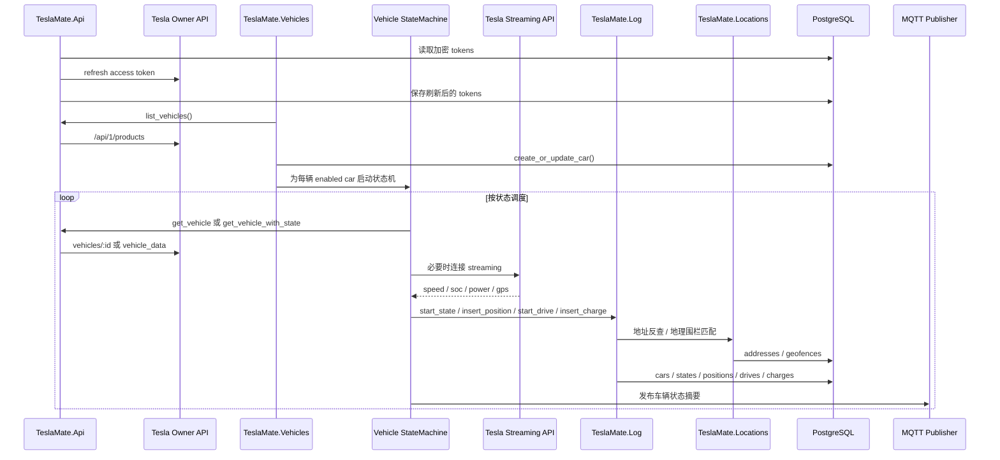
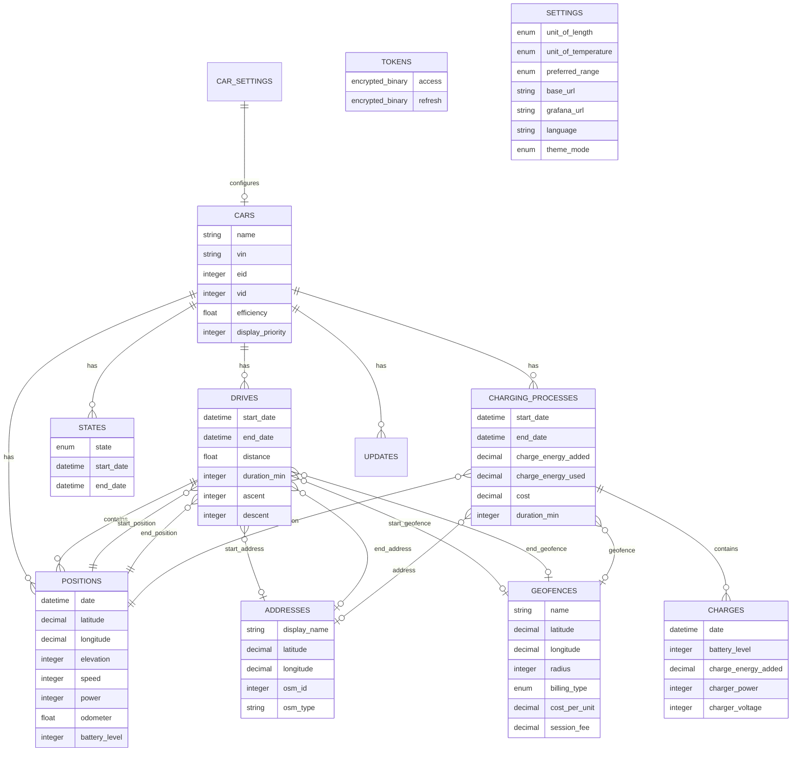
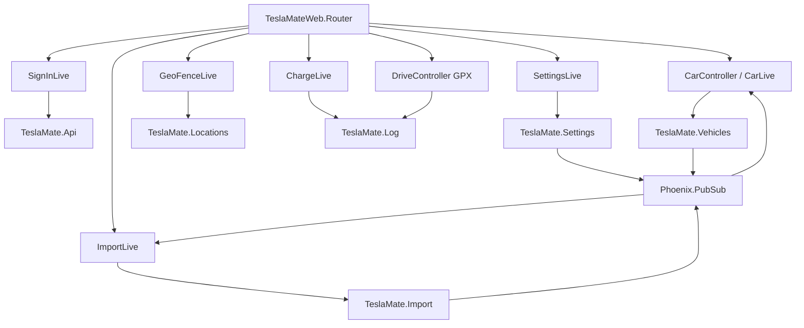

# TeslaMate 功能与技术架构图

更新日期：2026-07-09
当前分支：`dev-main`
当前版本：`4.1.0-dev.120260709.2154`

本文基于当前代码结构整理，重点覆盖 `lib/teslamate`、`lib/teslamate_web`、`lib/tesla_api`、`grafana` 和本地 `docker-compose.yml`。

## 1. 主要功能模块

| 模块边界 | 关键代码 | 职责 |
| --- | --- | --- |
| Web UI / API | `lib/teslamate_web` | Phoenix Endpoint、Router、LiveView 页面、HTTP API、布局、国际化 session |
| 登录与 Token | `TeslaMate.Auth`、`TeslaMate.Api`、`TeslaApi.Auth` | 保存加密 token、刷新 token、维护内存 auth、登录/登出 |
| Tesla API Client | `lib/tesla_api` | Owner API、车辆详情、Streaming WebSocket、Fleet auth middleware |
| 车辆采集状态机 | `TeslaMate.Vehicles`、`TeslaMate.Vehicles.Vehicle` | 每辆车一个 GenStateMachine，负责轮询、stream、状态转换和采集调度 |
| 数据记录 | `TeslaMate.Log`、`lib/teslamate/log/*` | 写入车辆、位置、行程、充电、状态、OTA 更新等数据库记录 |
| 设置 | `TeslaMate.Settings`、`lib/teslamate/settings/*` | 全局设置、车辆设置、语言/单位/休眠策略、PubSub 通知 |
| 地理位置 | `TeslaMate.Locations`、`Geocoder`、`GeoFence` | 地址反查、地理围栏、充电费用规则、历史记录回填 |
| 海拔 | `TeslaMate.Terrain` | SRTM 海拔查询，补齐历史 position elevation |
| MQTT | `TeslaMate.Mqtt`、`Publisher`、`PubSub` | 连接 broker 并发布车辆状态/指标 |
| CSV 导入 | `TeslaMate.Import` | 读取 TeslaFi CSV，转换成虚拟 Tesla API 数据流，复用车辆状态机导入 |
| 修复任务 | `TeslaMate.Repair` | 定期补齐行程/充电记录缺失地址 |
| 更新检查 | `TeslaMate.Updater` | 调用 GitHub Releases 检查 TeslaMate 新版本 |
| 数据库 | `TeslaMate.Repo`、`priv/repo/migrations` | PostgreSQL/Ecto schema 与迁移 |
| Grafana | `grafana/` | Dashboard、datasource provisioning、可视化查询 |

## 2. 功能架构图



## 3. 技术部署架构图

当前本地部署由 `docker-compose.yml` 编排。

```mermaid
flowchart LR
  Browser[浏览器] -->|HTTP :4001| TM[TeslaMate 容器]
  Browser -->|HTTP :3000| GF[Grafana 容器]

  subgraph TeslaMateContainer[TeslaMate: Phoenix/Elixir Release]
    Endpoint[Phoenix Endpoint]
    Repo[Ecto Repo]
    Vault[Cloak Vault]
    Finch[Finch HTTP Pools]
    Api[TeslaMate.Api]
    Vehicles[Vehicles Supervisor]
    VehicleSM[Vehicle GenStateMachine(s)]
    Log[Log Context]
    Locations[Locations Context]
    Terrain[Terrain Worker]
    Mqtt[Mqtt Supervisor]
    Import[Import Worker]
    Repair[Repair Worker]
    Updater[Updater Worker]

    Endpoint --> Repo
    Endpoint --> Api
    Endpoint --> Vehicles
    Endpoint --> SettingsCtx[Settings Context]
    Api --> Vault
    Api --> Finch
    Vehicles --> VehicleSM
    VehicleSM --> Log
    VehicleSM --> Locations
    VehicleSM --> Terrain
    VehicleSM --> Mqtt
    Log --> Repo
    Locations --> Repo
    Terrain --> Repo
    SettingsCtx --> Repo
    Import --> VehicleSM
    Repair --> Locations
    Repair --> Repo
    Updater --> Finch
  end

  TM -->|SQL| PG[(PostgreSQL 18)]
  GF -->|SQL| PG
  TM -->|MQTT| Mosquitto[Mosquitto]

  Finch -->|HTTPS| TeslaOwner[Tesla Owner API]
  VehicleSM -->|WSS| TeslaStream[Tesla Streaming API]
  Finch -->|HTTPS| Nominatim[OpenStreetMap Nominatim]
  Terrain -->|SRTM cache/files| SRTM[SRTM elevation data]
  Updater -->|HTTPS| GitHub[GitHub Releases API]
```

## 4. OTP 监督树

`TeslaMate.Application.children/0` 是运行时骨架。正常模式和导入模式会启动不同 worker。



## 5. 车辆采集主流程



## 6. 核心数据模型图



## 7. Web 页面与后端上下文关系



## 8. 后续开发建议

- 新功能优先判断属于哪个上下文：`Web`、`Api/Auth`、`Vehicles`、`Log`、`Locations`、`Settings`、`Import`、`MQTT`。
- 车辆采集相关改动优先从 `TeslaMate.Vehicles.Vehicle` 的状态转换入手，但提交要尽量小，因为该文件是系统风险最高的核心状态机。
- 数据写入逻辑优先放在 `TeslaMate.Log`，避免 Web 或状态机直接操作多个表。
- UI 页面保持通过上下文模块访问数据，避免 LiveView 直接拼复杂 Ecto query。
- 与外部网络有关的逻辑应继续走 `TeslaMate.HTTP` / Finch pools，并考虑当前本地网络不稳定时的离线构建约束。
