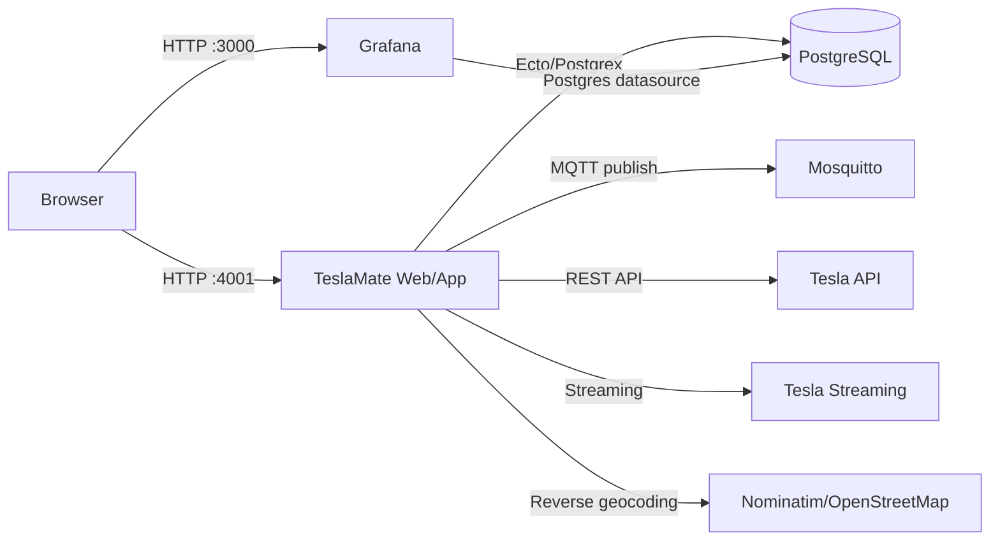
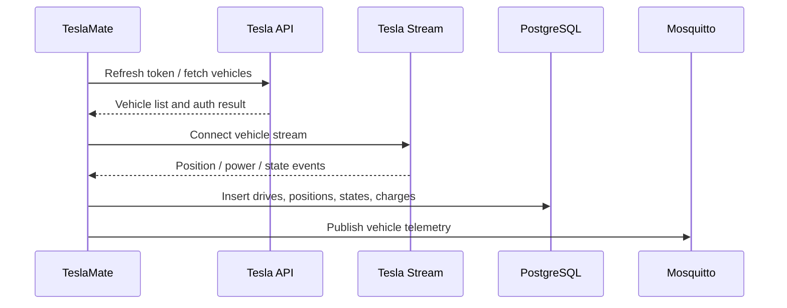

# TeslaMate 功能与架构文档

更新日期：2026-07-08  
当前分支：`dev-main`
当前本地版本：`4.1.0-dev.120260709.2154`
本地访问地址：

- TeslaMate Web：`http://localhost:4001`
- 登录页：`http://localhost:4001/sign_in`
- Grafana：`http://localhost:3000`

## 1. 项目定位

TeslaMate 是一个自托管 Tesla 数据记录系统。它通过 Tesla API 和车辆 streaming 数据采集车辆状态、行程、充电、位置、更新等数据，写入 PostgreSQL，并通过 Grafana 提供仪表盘分析。

当前本地环境已经导入服务器备份数据库，并使用服务器原 `ENCRYPTION_KEY` 恢复了 API token 解密能力。启动日志已确认 token 可刷新、车辆可连接 streaming。

## 2. 核心功能

### 2.1 Tesla 账号与 Token

- 登录页：`/sign_in`
- 支持通过 Access Token 和 Refresh Token 登录。
- Token 存储在 PostgreSQL 的 `private.tokens` 表。
- Token 通过 `ENCRYPTION_KEY` 加密/解密。
- 本地已验证：恢复服务器 `ENCRYPTION_KEY` 后，应用能刷新 Tesla API token。

相关模块：

- `TeslaMate.Auth`
- `TeslaMate.Auth.Tokens`
- `TeslaApi.Auth`
- `TeslaApi.Auth.Refresh`
- `TeslaMate.Vault`

### 2.2 车辆采集与状态记录

系统启动后会加载车辆信息，并为车辆启动 logger。车辆在线时连接 stream，持续采集状态。

记录的数据包括：

- 车辆在线/离线/睡眠状态
- 行驶过程
- 位置轨迹
- 充电过程
- 电量、续航、能耗
- OTA 更新历史
- 车辆基础配置和显示信息

相关模块：

- `TeslaMate.Vehicles`
- `TeslaMate.Vehicles.Vehicle`
- `TeslaMate.Log`
- `TeslaMate.Log.Car`
- `TeslaMate.Log.Drive`
- `TeslaMate.Log.Position`
- `TeslaMate.Log.State`
- `TeslaMate.Log.Charge`
- `TeslaMate.Log.ChargingProcess`
- `TeslaMate.Log.Update`

### 2.3 地理位置与地理围栏

TeslaMate 会对车辆位置做地址解析，并支持自定义地理围栏。

功能包括：

- 地址反查
- 常用地点识别
- 地理围栏创建、编辑、删除
- 基于地点的充电费用配置

相关页面：

- `/geo-fences`
- `/geo-fences/new`
- `/geo-fences/:id/edit`
- `/charge-cost/:id`

相关模块：

- `TeslaMate.Locations`
- `TeslaMate.Locations.Address`
- `TeslaMate.Locations.GeoFence`
- `TeslaMate.Locations.Geocoder`

### 2.4 设置与导入

系统提供全局设置、车辆设置和历史数据导入能力。

相关页面：

- `/settings`
- `/import`

相关模块：

- `TeslaMate.Settings`
- `TeslaMate.Settings.GlobalSettings`
- `TeslaMate.Settings.CarSettings`
- `TeslaMate.Import`
- `TeslaMate.Import.CSV`
- `TeslaMate.Import.LineParser`

### 2.5 Grafana 仪表盘

Grafana 使用单独镜像 `teslamate/grafana:4.1.0-dev.120260709.2154`。该镜像内置：

- 数据源配置：`grafana/datasource.yml`
- Dashboard provisioning：`grafana/dashboards.yml`
- 内置 dashboard JSON：`grafana/dashboards/`

Grafana 连接同一个 PostgreSQL 数据库，读取 TeslaMate 写入的数据进行可视化。

#### Drive Details 速度轨迹图

行程详情继续使用正式 dashboard，而不是维护单独的 V2 副本：

- Dashboard UID：`zm7wN6Zgz`
- 访问路径：`/d/zm7wN6Zgz/drive-details`
- Dashboard 文件：`grafana/dashboards/internal/drive-details.json`

地图查询使用 `car_id`、`drive_id` 和 dashboard 时间范围筛选位置点，并同时返回 km/h、mph 及本次行程内的相对速度。轨迹颜色规则如下：

| 条件 | 轨迹颜色 | 含义 |
| --- | --- | --- |
| 速度低于 `5 km/h` | 黑色 | 低于普通步行速度或接近停止 |
| 不低于 `5 km/h`，且低于本次最高速度的 50% | 红色 | 较慢行驶区段 |
| 本次最高速度的 50%–80% | 绿色 | 中高速区段 |
| 本次最高速度的 80%–100% | 深绿色 | 本次行程最快区段 |

速度轨迹使用 4 px 线宽，底层叠加 8 px 黄色路线作为两侧描边。描边层关闭 tooltip，悬停时只展示速度轨迹的数据。Drives、Trip、Timeline 和路线排行 dashboard 均链接到上述正式入口。

### 2.6 MQTT

TeslaMate 将车辆数据发布到 MQTT broker。

当前本地使用：

- 镜像：`eclipse-mosquitto:2`
- 容器服务名：`mosquitto`
- TeslaMate 环境变量：`MQTT_HOST=mosquitto`

相关模块：

- `TeslaMate.Mqtt`
- `TeslaMate.Mqtt.Publisher`
- `TeslaMate.Mqtt.Handler`
- `TeslaMate.Mqtt.PubSub`
- `TeslaMate.Mqtt.PubSub.VehicleSubscriber`

## 3. 当前本地改动

### 3.1 登录页底部显示 Build 信息

在 `/sign_in` 页面底部新增：

```text
Build <build_id> | <build_date> | Version <version>
```

当前本地显示示例：

```text
Build test_ui_branch-da09dc3 | 2026-07-08T02:27:58+08:00 | Version 4.1.0-dev
```

实现位置：

- `lib/teslamate_web/live/signin_live/index.ex`
- `lib/teslamate_web/live/signin_live/index.html.heex`
- `Dockerfile`

实现方式：

- `Dockerfile` 增加 `BUILD_ID` 和 `BUILD_DATE` build args。
- 运行镜像中写入环境变量：
  - `TESLAMATE_BUILD_ID`
  - `TESLAMATE_BUILD_DATE`
- LiveView 从环境变量读取 build 信息。
- 版本号从 `Application.spec(:teslamate, :vsn)` 读取。

### 3.2 Windows 换行兼容

Windows checkout 曾把 `entrypoint.sh` 转成 CRLF，导致 Linux 容器中 `/bin/dash` 报错：

```text
/entrypoint.sh: 2: set: Illegal option -
```

已通过 `.gitattributes` 固定关键文件 LF：

```gitattributes
*.sh text eol=lf
Dockerfile text eol=lf
**/Dockerfile text eol=lf
```

## 4. 运行架构

当前本地 Compose 栈包含 4 个服务：

| 服务 | 镜像 | 作用 | 端口 |
| --- | --- | --- | --- |
| `teslamate` | `teslamate:4.1.0-dev-da09dc3` | Web UI、API、采集、后台任务 | `4001:4000` |
| `database` | `postgres:18-trixie` | 主数据存储 | 仅 Compose 网络内访问 |
| `grafana` | `teslamate/grafana:4.1.0-dev-da09dc3` | Dashboard 可视化 | `3000:3000` |
| `mosquitto` | `eclipse-mosquitto:2` | MQTT broker | 仅 Compose 网络内访问 |

### 4.1 容器关系



### 4.2 应用内部监督树

`TeslaMate.Application` 启动的主要进程：

- `TeslaMate.Repo`：数据库访问层。
- `TeslaMate.Vault`：加密 token 支持。
- `TeslaMate.HTTP`：HTTP client。
- `TeslaMate.Api`：Tesla API 抽象。
- `TeslaMate.Updater`：更新检查。
- `Phoenix.PubSub`：内部事件发布订阅。
- `TeslaMateWeb.Endpoint`：Phoenix Web endpoint。
- `TeslaMate.Terrain`：地形/海拔数据支持。
- `TeslaMate.Vehicles`：车辆进程管理。
- `TeslaMate.Mqtt`：MQTT 发布。
- `TeslaMate.Repair`：数据修复任务。

## 5. Web 与 API 入口

主要 Web 路由：

| 路径 | 功能 |
| --- | --- |
| `/` | 车辆首页 |
| `/sign_in` | Token 登录页 |
| `/settings` | 设置 |
| `/geo-fences` | 地理围栏列表 |
| `/geo-fences/new` | 新建地理围栏 |
| `/geo-fences/:id/edit` | 编辑地理围栏 |
| `/charge-cost/:id` | 充电费用 |
| `/import` | 数据导入 |
| `/drive/:id/gpx` | 导出行程 GPX |

API 路由：

| 方法 | 路径 | 功能 |
| --- | --- | --- |
| `PUT` | `/api/car/:id/logging/resume` | 恢复车辆记录 |
| `PUT` | `/api/car/:id/logging/suspend` | 暂停车辆记录 |

## 6. 数据库

数据库服务：

- 镜像：`postgres:18-trixie`
- 数据库：`teslamate`
- 用户：`teslamate`
- 数据卷：`teslamate-db`

当前已导入服务器备份数据，关键表数据量：

| 表 | 记录数 |
| --- | ---: |
| `cars` | 1 |
| `drives` | 3912 |
| `charging_processes` | 562 |
| `positions` | 12496993 |
| `schema_migrations` | 100 |

核心表：

- `cars`
- `car_settings`
- `drives`
- `positions`
- `states`
- `charging_processes`
- `charges`
- `updates`
- `addresses`
- `geofences`
- `settings`
- `private.tokens`
- `schema_migrations`

## 7. 数据流

### 7.1 启动流程

1. `entrypoint.sh` 等待 PostgreSQL 可连接。
2. 执行数据库迁移：

   ```sh
   bin/teslamate eval "TeslaMate.Release.migrate"
   ```

3. 启动 release：

   ```sh
   bin/teslamate start
   ```

4. 应用读取 `ENCRYPTION_KEY` 并解密 token。
5. 刷新 Tesla token。
6. 加载车辆并启动车辆 logger。
7. 建立 MQTT 连接。
8. 车辆在线时连接 streaming。

### 7.2 采集流程



## 8. 构建与部署

### 8.1 App 镜像构建

当前本地镜像：

```text
teslamate:4.1.0-dev-da09dc3
teslamate:latest
```

构建命令示例：

```powershell
$short = (git rev-parse --short HEAD).Trim()
$buildId = "test_ui_branch-$short"
$buildDate = (Get-Date).ToString("yyyy-MM-ddTHH:mm:sszzz")

docker build `
  --build-arg "BUILD_ID=$buildId" `
  --build-arg "BUILD_DATE=$buildDate" `
  -t teslamate:4.1.0-dev-da09dc3 `
  -t teslamate:latest .
```

### 8.2 Grafana 镜像构建

当前本地镜像：

```text
teslamate/grafana:4.1.0-dev.120260709.2154
```

构建命令：

```powershell
docker build `
  -t teslamate/grafana:4.1.0-dev.120260709.2154 `
  .\grafana

docker compose up -d --force-recreate grafana
```

Dashboard JSON 通过 `grafana/Dockerfile` 复制到镜像中的 `/dashboards`、`/dashboards_internal` 或 `/dashboards_reports`，当前 Compose 没有把工作区 dashboard 目录挂载到 Grafana 容器。Provisioning 的扫描间隔为 86400 秒，因此只刷新浏览器不会加载工作区中的 JSON 修改；开发时需要重新构建镜像并重建 Grafana 容器。

### 8.3 启动与重启

启动全栈：

```powershell
docker compose up -d
```

重启 TeslaMate app：

```powershell
docker compose up -d --force-recreate teslamate
```

查看状态：

```powershell
docker compose ps
```

查看日志：

```powershell
docker compose logs --tail=100 teslamate
```

## 9. 配置与安全

当前本地 `.env` 包含：

- `ENCRYPTION_KEY`
- `DATABASE_PASS`

注意事项：

- `.env` 已被 `.gitignore` 忽略，不应提交。
- `ENCRYPTION_KEY` 必须和原服务器一致，否则历史 token 无法解密。
- 更换 `ENCRYPTION_KEY` 会影响 `private.tokens` 中已有 token。
- 如果 token 无法解密，需要恢复原 key 或重新登录 Tesla。

## 10. 备份与恢复

### 10.1 备份数据库

```powershell
docker compose exec -T database pg_dump -U teslamate teslamate > teslamate.bck
```

### 10.2 恢复数据库

恢复前建议停止 app 和 Grafana：

```powershell
docker compose stop teslamate grafana
```

清空 schema 并导入 plain SQL dump：

```powershell
docker compose exec -T database psql -v ON_ERROR_STOP=1 -U teslamate -d teslamate -c "DROP SCHEMA IF EXISTS private CASCADE; DROP SCHEMA IF EXISTS public CASCADE; CREATE SCHEMA public AUTHORIZATION teslamate; GRANT ALL ON SCHEMA public TO teslamate; GRANT ALL ON SCHEMA public TO public;"
docker compose exec -T database psql -v ON_ERROR_STOP=1 -U teslamate -d teslamate -f /tmp/teslamate-restore.bck
```

恢复后启动：

```powershell
docker compose up -d teslamate grafana
```

## 11. 运维检查清单

- `docker compose ps` 中 4 个服务都应为 `Up`。
- TeslaMate 日志应出现：
  - `Version: 4.1.0-dev`
  - `Refreshed api tokens`
  - `MQTT connection has been established`
  - `Starting logger for ...`
- 如果出现 `Could not decrypt API tokens!`，优先检查 `ENCRYPTION_KEY`。
- Grafana 数据源依赖 PostgreSQL，数据库未启动时 dashboard 不可用。
- 本地 TeslaMate 使用 `4001:4000`，因为主机已有其他容器占用 `4000`。

## 12. 后续建议

- 为当前 `test_ui_branch` 增加一次提交，固定 build 信息展示和 LF 换行规则。
- 若要长期运行，建议把 `docker-compose.yml` 中镜像 tag 固定到明确版本，而不是只依赖 `latest`。
- 对数据库备份建立定时任务，并把备份文件存放到 Docker volume 以外的位置。
- 不要把 `.env`、数据库备份、token 或服务器配置提交到 Git。
